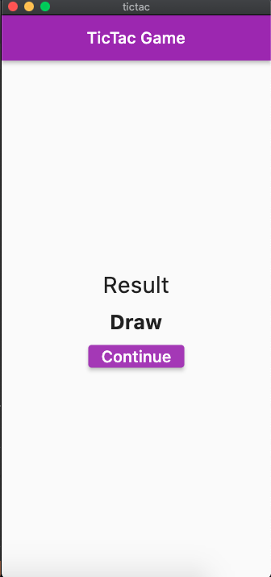

# TicTac Game

A TicTac Game made with Flutter/Dart (No libraries)

## Getting Started

Clone this repo

Run `flutter clean && flutter pub get` in your terminal

Finally `flutter run` in your terminal

## Screenshots

### PRs are opened :)

